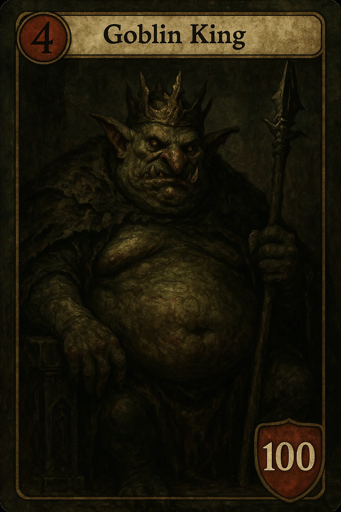
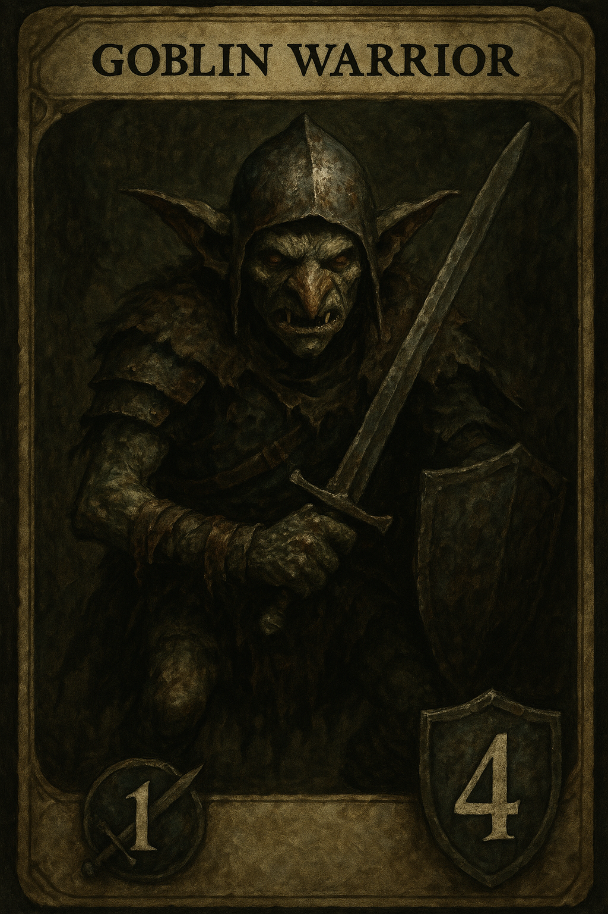

# Convocation Game rules

This will be the first edition of the Convocation game rulebook, this book will have several editions as the game development keeps going.

I will break the game rulebook into 3 sections: 

- General section: Here I will explain the core mechanics of the game, how the game plays, what the players can do on It, how the players interact with each other, etc..

- Creature Rules: This will include the explanation about the creatures, "what is a creature", "what does it do", "how it works", etc...

- Battlefield Rules: Here you will find some explanation about the battlefield and how It works, all its divisions, how it interacts with each other, etc...

<h2>Game Rules</h2>

the game is a PvP 1v1 turn-based card game, where the players take turns against each other with the objective of winning the game;

The main objective of the game is to reduce the enemy's hero health to zero, the way the players do that is by summoning creatures to the battlefield;

Each player will control a hero like this

The Goblin king, every hero will have by default 100 health.

- Every hero will come with its own deck, containing 40 cards Minimum, the Goblin king for example will have a Goblin themed deck, the great majority of his deck will be goblin creatures;

- The players will be able to customize their decks, the decks need 40 cards minimum, 50 cards maximum;

- 25 of the cards of the deck need to match the race of the selected hero;

<em>EXAMPLE: If the player chooses the "Goblin king" hero, 25 of the cards on the deck needs to be Goblin cards;</em>

<h3>Creatures</h3>

The main objective of the game is to reduce the enemy's hero health to zero, the way the players do that is by summoning creatures to the battlefield;

- Each creature will have 2 stats by default, attack (represented by a sword behind a number on the left side of the card) and defense (represented by a shield behind the number on the right side of the card)

- Each creature will take 1 of the player's Convocations to put it on the field, this "Convocations" will be a limited resource that players will have 2 of them per turn (BY DEFAULT).

Example of a creature: 

- He has 1 attack (represented by the sword) and 4 defense (represented by the shield)

- Each creature can only attack once per turn (BY DEFAULT);

- If the creatures' defense reaches 0, it dies and the card leaves the field;

Every creature will fit into 2 categories: 

- Melee creatures: this creatures will be placed on the front line of the battlefield;

- Ranged creatures: this creatures will be placed on the back line of the battlefied;

<h3>Battlefield</h3>

The game game will take place in a battlefield, each player will have their side of the field; where they will convocate their creatures to fight for them;

The battlefield is divided into 2 parts: Front line and Back line, these 2 lines have 5 positions each, so the maximum number of creatures on your side of the field is 10, 5 on the Front line and 5 on the Back line; 

- Front line: here you place your melee creatures, those creatures serve as "barrier" for incoming attacks, he protects all the creatures on the back line and your hero as well, the enemy NEEDS to clear all your front line first before commiting an attack on your back line or you hero;

- Back line: here you place your ranged creatures, those creatures DO NOT block your enemy's attack on your hero, he can just ignore the creatures of the back line if he feels its right to do so;

<h3>Game flow</h3>

When the starts, the game will decide which player is gonna play the first turn, each player is going to draw 6 cards and they will look into their own hands, if they don't like their hands, they can click on a button called "Redraw" to draw another hand instead;

Every turn will start with a phase called "Draw phase", where the turn owner draws 1 card from his deck, if he doesn't have any card left in the deck during the draw phase, this player will loose the game;

Each turn, the player will have 2 "Convocations", these "Convocations" are a resource used for convoquing creatures to your side of the field, they are refilled every start of a turn, every creature will cost 1 "Convocation" by default;

When the player is satisfied with his turn, he can pass the turn to the enemy player and the whole flow repeats itself;