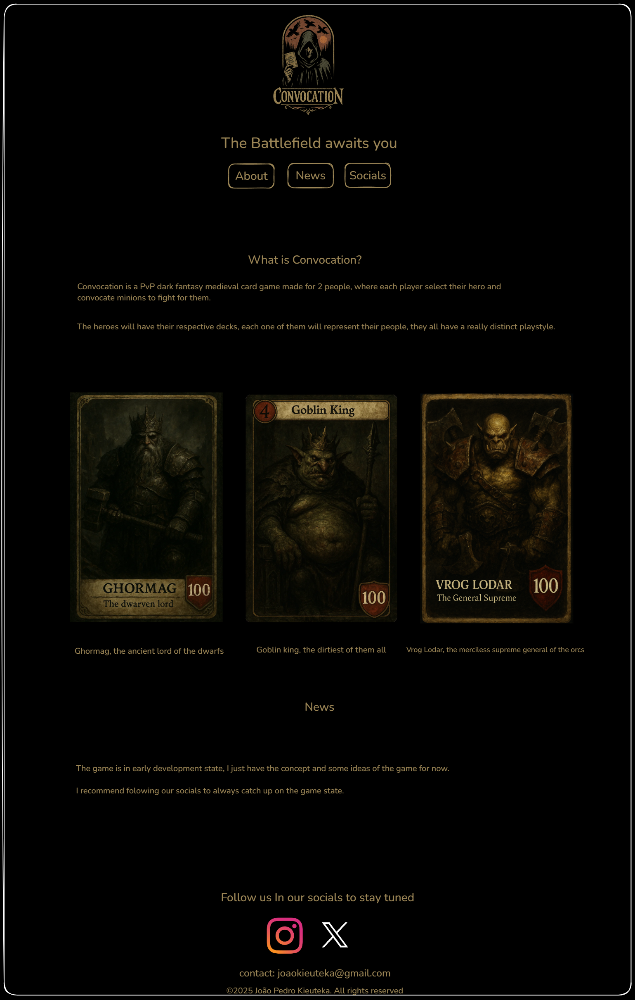

# Game hotsite

The main Idea here is to create a website that is pretty simple inittialy, just with some cool explanation about the game and the hero cards arts, to grab the attention of the viewer.

# Design prototype

-OBS: I'll break the website into 4 sections initially.

# Header

the header section will only include the logo of the game and some navegation buttons that will take the user to the different sections of the page.

# About Section

Here will take place the cool explanation about the game and hero cards, this is just a explanation to grab the attention of the viewer, not a full in-depth rulebook of the game.

# News Section

Here will be where I will release some notes about the development of the game, after the release of the game, I will use this section to inform players about upcoming features and changes for the game.

# Footer

This will be the section with a lot of social links and contact links, pretty simple one.
