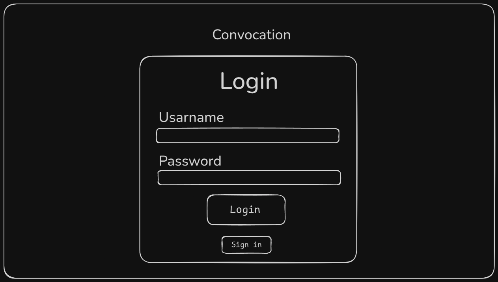
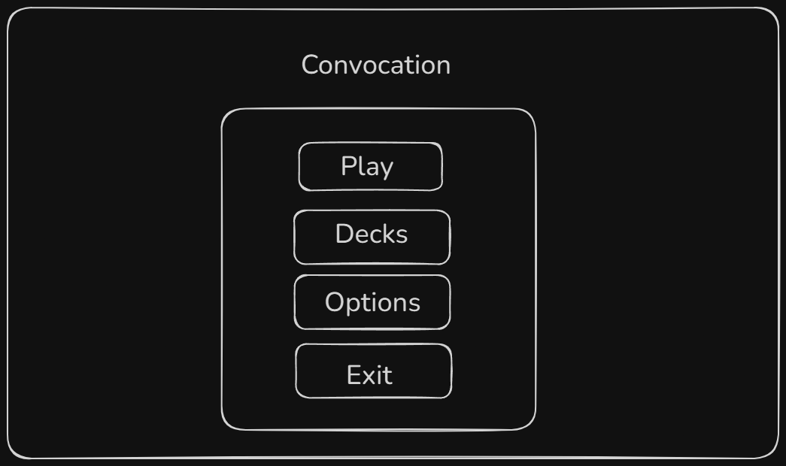
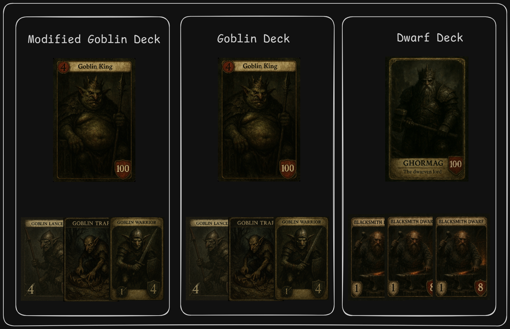
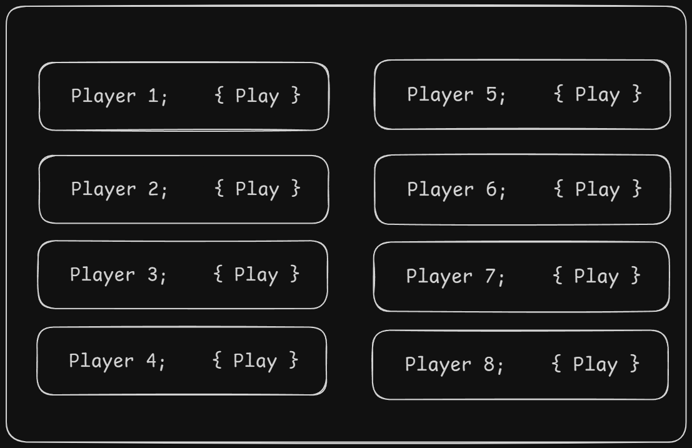
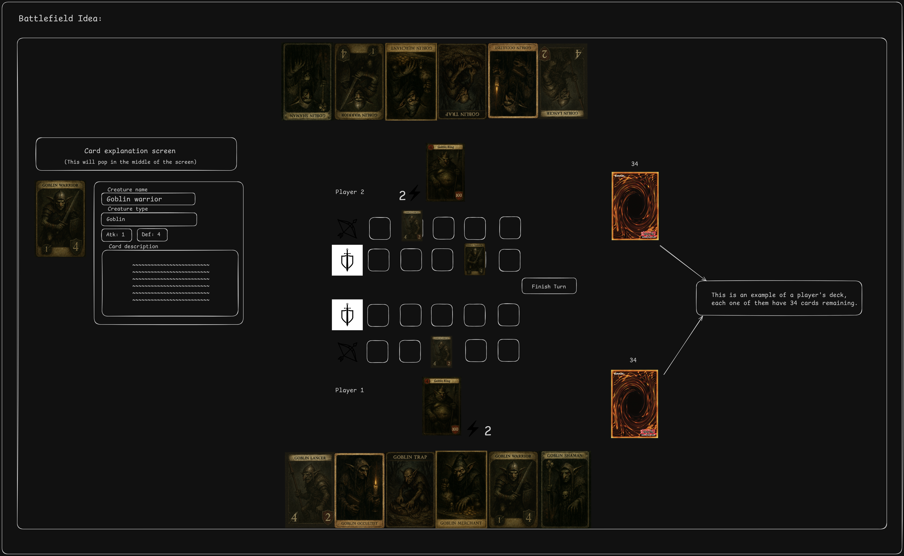
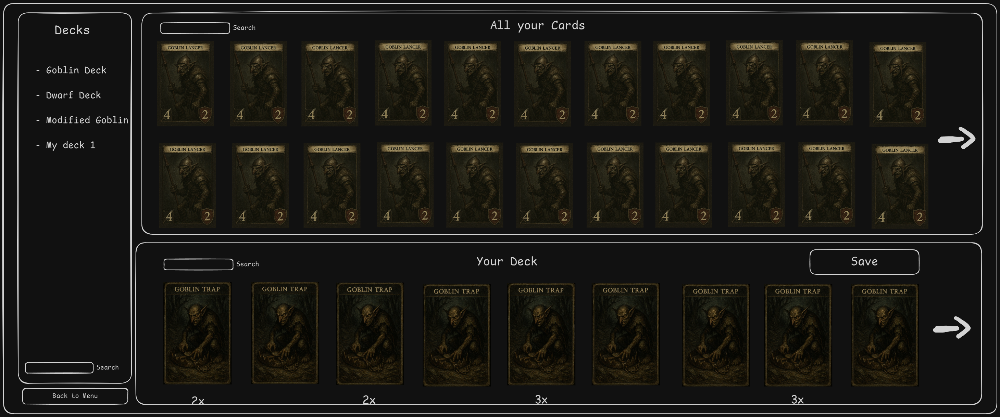

# User interaction purposal

This will be the documentation about all the user interactions present in the game, I will break into -- sections: 

- Login Screen: this will be the explanation about the Login screen, the first page the user will have contact with;

- Menu screen: this will be the main menu of the game, here they will find all the options for interacting with the game;

- Match preparation screen: this will be a little screen to get ready for the game;

- Matchmaking screen: This will be a page where you will find another players to play with;

- Battlefield screen: that's the most complex one, here is where the game takes place;

- Deck creation: Here the user will see all the decks the game has, he will be able to create new decks and customize them as well;

<h2>Login Screen</h2>

This is the first screen the player will have contact with, There will be some 2 forms: username and password, where the players enters his credentials to authenticate with the database, there will be a "Sign in" button as well, where the player will fill 3 forms: E-mail, username and password to registrate their account on the database;

<em>Example of the login screen prototype:</em>

<h2>Menu screen</h2>

The main menu of the game, here there will be 4 buttons: 

- Play: this button will take you to the match preparation screen;

- Decks: this button will take you to the match Deck creation;

- Options: a little options screen that will have some customizable adjustments to increment the game experience (EXAMPLE: music volume, sound effects volume, etc...);

- Exit: a button to close the game;

<em>Example of the Menu screen prototype:</em>

<h2>Match preparation screen</h2>

This will be a little screen to the players to select their decks and get ready for the matches;

<em>Example of the Match preparation screen prototype:</em>

<h2>Matchmaking screen</h2>

This will be a page where it will lists all the players looking for a match, the page will separate boxes for each player, with a button called "play" inside of this box, when a player clicks on that button, the game will send a match request to the other player, if the other player accepts, the game begins;

<em>Example of the Matckmaking screen prototype:</em>

<h2>Battlefield screen</h2>

This will be the most important one, the page where the game itself runs, the players will see the battlefield from a top-view perspective, they will drag and drop their cards into the field and summon them;

If the player clicks right click on a card, the card explanation will show up in the middle of the screen;

<em>Example of the Battlefield screen prototype:</em>

- The heroes of each players will be displayed under their creature lines;

- A number with a lightning bolt on the side will display the numbers of "Convocations" the player has left;

- The Back line is displayed with 5 rectangulars positions with a bow and an arrow on the side of it;

- The Front line is displayed with 5 rectangulars positions with a sword and shield on the side of it;

- The players can click on their creatures to make an attack, drag it to the enemy's creature and let it go to make the attack happens;

- In between the 2 fields there will be a little button for ending your turn and passing to your enemy;

- On the border bottom of the screen, just under your hero, there will be where your hand cards are;

- On the border top of the screen, just above the enemy hero, there will be where your enemy's hand cards are (Obviously they are not shown to you this is just an example);

- The 2 decks are going to be displayed on the right side of the screen, with a number under it simbolyzing how many cards are remaning on each deck;

<h2>Deck creation screen</h2>

This will be a little screen with a deck creator, where the player can see all the decks they have and even customize them to their own liking;

<em>Example of the Deck creator screen prototype:</em>

This screen will be divided into 3 main blocks: 

- "Decks" block: here you will have a list of all your decks, there will be a search button on the bottom as well to search for a specific deck name;

- "Your cards" block: here the user will see all the cards that his account currently have, there is also a search button to search for a specific card all of your collection, on the side of it there will be an arrow to go to the next page of this same block;

- "Your deck" block: here will be a horizontal list of all the cards of the currently selected deck, with a little number under it symbolizing how many of that cards are on your deck, there is also a search button to search for a specific card on your deck, on the side of it there will be an arrow to go to the next page of this same block, on the top right side there will be a "Save button" to save all the changes the user made to that deck;

